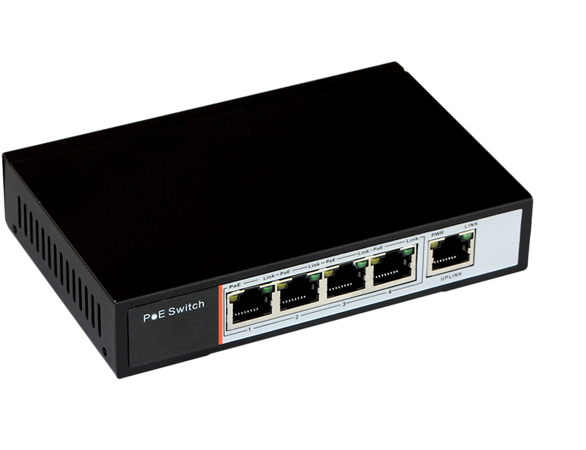
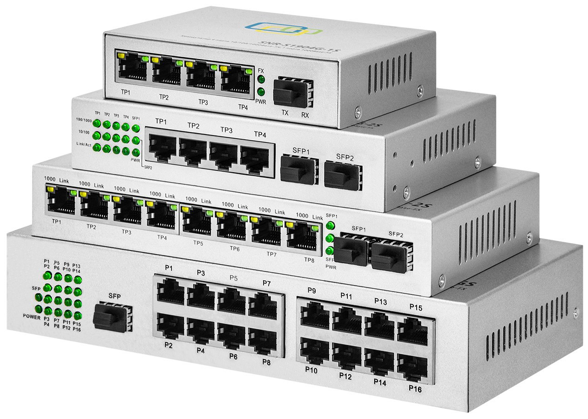
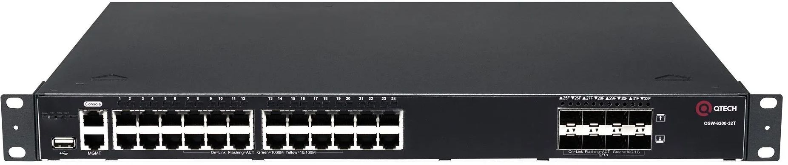
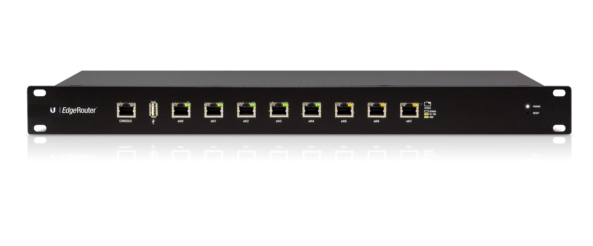

# Урок 7. Сетевые устройства

В предыдущих уроках вы познакомились со всеми уровнями модели TCP/IP — данные в ней обрастают заголовками, как снежный ком. Самое время познакомиться с сетевым оборудованием, которое использует сетевые протоколы для передачи данных. В рамках этого урока мы рассмотрим основные типы сетевого оборудования: коммутатор (свитч, хаб), маршрутизатор (он же роутер), межсетевой экран (фаервол) и точки доступа.


## Коммутатор

Коммутатор соединяет устройства в одной сети (как компьютеры в офисе или ваши устройства дома). Он знает, какое устройство подключено к какому порту, и отправляет информацию только туда, куда нужно. Если совсем упростить, то коммутатор - это как многопортовый удлинитель для интернета. Он берёт интернет из одного места (например, из роутера) и раздаёт его сразу нескольким устройствам (компьютерам, принтерам, телевизорам) в вашей сети.

<p align="center">

</p>

Представьте многоквартирный дом. Коммутатор - это почтальон внутри этого дома. Он знает, в какую квартиру нужно доставить каждое письмо и не разносит его всем подряд. Он знает, что "Компьютер А" живет в квартире "Порт 1", а "Компьютер Б" - в квартире "Порт 2".

Коммутаторы различаются по многим параметрам, в рамках этого урока мы расскажем про основные типы коммутаторов, но не про все, чтобы вас не напугать и хватило времени рассказать про маршрутизаторы и межсетевые экраны.

Начнём с  с конструктивных особенностей. Коммутаторы различаются:

- по количеству портов. Как правило от 4 до 48+

<p align="center">

</p>

- по способу монтажа. Стоечные (Rack mount), настольные. Стоечные оснащены специальными пластинами(ушами) с помощью которых коммутаторы устанавливаются в серверную стойку:

<p align="center">

</p>

- модульные коммутаторы. Эти коммутаторы имеют шасси, в которое можно устанавливать различные модули, такие как портовые модули, модули питания, модули управления и т.д.

<p align="center">

</p>

- Коммутаторы с возможностью стекирования (Stackable Switches). Эти коммутаторы можно соединять вместе с помощью специальных кабелей (стековых кабелей) для создания одного логического коммутатора. Это позволяет увеличить количество портов и повысить производительность.

- по типу портов. Обычно используются порты RJ-45, но так же бывают оптические свитчи (SFP), и комбинированные свитчи с RJ45 и SFP.

- по скорости передачи данных портов. 10 мбит\сек, 100 мбит\сек, 1 Гбит\сек.

С визуальной частью разобрались, полезли "под капот". 

Коммутатор работает на канальном уровне (Layer 2) модели OSI. Его основная задача — пересылать данные (кадры) между устройствами в локальной сети (LAN). Он делает это, используя MAC-адреса устройств. Процесс выглядит примерно так:

1. Коммутатор получает кадр данных на одном из своих портов.
2. Коммутатор смотрит на MAC-адрес назначения в заголовке кадра.
3. Коммутатор ищет MAC-адрес назначения в своей CAM-таблице (Content Addressable Memory).
4. Пересылка или широковещание:

  •  Если MAC-адрес найден: Коммутатор пересылает кадр только на тот порт, который связан с этим MAC-адресом. Это называется одноадресной пересылкой (unicast).
  
  •  Если MAC-адрес не найден: Коммутатор рассылает кадр на все порты, кроме порта, с которого он пришел. Это называется широковещательной пересылкой (broadcast). Это происходит, например, когда устройство впервые появляется в сети и коммутатор еще не знает, на каком порту оно находится.
  
5. Коммутатор также "учится", добавляя MAC-адреса отправителей из входящих кадров в свою CAM-таблицу, связывая их с портом, на который пришел кадр.

Немного подробнее остановимся на CAM-таблице (Content Addressable Memory), так как это важный момент в работе коммутатора.

Получив пакет, коммутатор анализирует MAC-адрес источника в этом пакете и затем использует его для обновления CAM-таблицы. Она помогает коммутатору оптимизировать пересылку данных, избежать ненужного широковещательного трафика.

Вот как происходит заполнение CAM-таблицы:

При получении кадра коммутатор проверяет MAC-адрес источника → Если MAC-адреса нет в CAM-таблице, он добавляет его и ассоциирует с портом, через который пришёл кадр → Когда нужно отправить данные на MAC-адрес, коммутатор использует CAM-таблицу, выявляя через неё нужный порт для доставки.

Допустим, у нас есть коммутатор с тремя подключёнными узлами:

Узел A с MAC-адресом AA:AA:AA:AA:AA:AA подключён к порту 1 коммутатора.

Узел B с MAC-адресом BB:BB:BB:BB:BB:BB подключён к порту 2 коммутатора.

Узел C с MAC-адресом CC:CC:CC:CC:CC:CC подключён к порту 3 коммутатора.


Когда узел A отправляет пакет через коммутатор, в CAM-таблицу попадает запись вида узел с MAC-адресом AA:AA:AA:AA:AA:AA подключен к 1 порту. Если узел B отправит пакет устройству A, коммутатор обновит свою таблицу и запишет, что узел B с MAC-адресом BB:BB:BB:BB:BB:BB подключён к порту 2.

Затем он сверится с таблицей вновь и увидит, что узел A находится на первом порту, и сразу отправит пакет туда. Если записи в CAM-таблице не будет (к примеру, узел A отправит пакет узлу C), коммутатор отправит пакет на все порты.

По своим функциональным особенностям коммутаторы в первую очередь делятся на неуправляемые и управляемые коммутаторы.

Неуправляемый коммутатор - это самый простой тип сетевого коммутатора. Он работает по принципу "подключи и работай" (plug-and-play). Вам не нужно его настраивать, он просто соединяет устройства в локальной сети (LAN) и автоматически пересылает данные между ними.

Управляемый коммутатор — это сетевой коммутатор, который позволяет администратору сети настраивать, контролировать и управлять его работой. В отличие от неуправляемых коммутаторов, которые работают "из коробки" без какой-либо настройки, управляемые коммутаторы предоставляют широкий набор функций и возможностей для оптимизации производительности сети, обеспечения безопасности и управления трафиком.

Остановимя на основных функциях управляемых коммутаторов (дальше я их буду называть свитчами, потому что устал писать коммутатор) и для чего они нужны.

1. Способы управления:

•  Веб-интерфейс (GUI): Графический интерфейс, доступный через веб-браузер. Он обычно предоставляет удобный и интуитивно понятный способ настройки и управления коммутатором.

•  Интерфейс командной строки (CLI): Текстовый интерфейс, доступный через Telnet, SSH или консольный порт. CLI предоставляет более продвинутые возможности настройки и управления, но требует знания команд.

•  Протоколы управления: Поддержка протоколов управления, таких как SNMP, позволяет управлять коммутатором с помощью централизованных систем управления сетью.

2.  VLAN (Virtual LAN): Виртуальная локальная сеть. VLAN позволяет логически сегментировать физическую сеть на несколько виртуальных сетей. Устройства, находящиеся в разных VLAN, не могут общаться друг с другом напрямую, если не настроена маршрутизация между VLAN.

Коммутатор использует теги VLAN (VLAN IDs) для идентификации трафика, принадлежащего к определенной VLAN. Трафик, помеченный определенным VLAN ID, пересылается только на порты, настроенные для этой VLAN.

Пример: В офисе есть отделы продаж, разработки и бухгалтерии. Каждый отдел можно поместить в отдельную VLAN (VLAN 10 для продаж, VLAN 20 для разработки, VLAN 30 для бухгалтерии). Это позволяет ограничить доступ к ресурсам каждого отдела и повысить безопасность. Например, можно запретить компьютерам отдела продаж получать доступ к серверам бухгалтерии.

Преимущества: Улучшенная безопасность, упрощенное управление сетью, повышение производительности за счет ограничения широковещательного трафика.

3.  QoS (Quality of Service): Качество обслуживания. QoS позволяет приоритизировать трафик в сети, чтобы обеспечить лучшую производительность для критически важных приложений.

QoS использует различные механизмы для классификации трафика (например, на основе IP-адресов, номеров портов, VLAN IDs) и назначения ему приоритета. Коммутатор может использовать различные алгоритмы для управления очередями трафика и предоставления приоритетного обслуживания трафику с высоким приоритетом.

Пример: В сети используются IP-телефония и видеоконференции. Для обеспечения хорошего качества связи можно настроить QoS таким образом, чтобы трафик VoIP и видео имел высокий приоритет, а трафик загрузки файлов - низкий приоритет. Это гарантирует, что голосовые и видеозвонки не будут прерываться из-за перегрузки сети.

Преимущества: Улучшенное качество обслуживания для критически важных приложений, снижение задержек и потерь пакетов.

4.  Spanning Tree Protocol (STP): Протокол связующего дерева. STP предназначен для предотвращения образования петель в сети. Петли могут возникать, когда в сети есть несколько путей для передачи данных между двумя устройствами. STP автоматически обнаруживает петли и блокирует один или несколько путей, чтобы избежать циклического распространения трафика.

STP использует алгоритм, который выбирает один корневой коммутатор (Root Bridge) в сети. Все остальные коммутаторы определяют оптимальный путь до корневого коммутатора и блокируют избыточные соединения, которые могут привести к образованию петель.

Пример: В сети есть два коммутатора, соединенных двумя кабелями для обеспечения отказоустойчивости. Без STP это приведет к образованию петли. STP автоматически заблокирует один из кабелей, чтобы предотвратить петлю, но если основной кабель выйдет из строя, заблокированный кабель будет автоматически активирован.

Преимущества: Предотвращение петель, обеспечение отказоустойчивости.

5.  Link Aggregation (LAG) / Port Channeling: Агрегирование каналов. LAG позволяет объединить несколько физических портов в один логический канал, увеличивая пропускную способность и обеспечивая отказоустойчивость.

LAG использует протоколы, такие как LACP (Link Aggregation Control Protocol), для автоматического обнаружения и настройки агрегированных каналов. Трафик распределяется между физическими портами в канале, увеличивая общую пропускную способность. Если один из портов выходит из строя, трафик автоматически перенаправляется на другие порты в канале.

Пример: Сервер подключен к коммутатору двумя гигабитными каналами. Объединив эти два канала в LAG, можно получить пропускную способность 2 Гбит/с. Если один из каналов выйдет из строя, сервер продолжит работать на скорости 1 Гбит

Преимущества: Увеличение пропускной способности, отказоустойчивость.

Более подробно про настройку свитчей поговорим в следующих темах, сейчас же пройдём небольшой квиз и расскажем про маршрутизаторы(я их буду называть роутеры, ещё раздел не начался, а я уже сдаюсь, но мне коммутаторов хватило))

## Квиз 1

Ниже перечислены особенности коммутаторов. Вам нужно выбрать к какому типу коммутаторов они относятся: управляемые, неуправляемые, оба.

1. Отсутствие конфигурации.

а. управляемые

б. неуправляемые 

в. оба

Правильный ответ: б

2. Использование MAC-адресов

а. управляемые

б. неуправляемые 

в. оба 

Правильный ответ: в

3. Физические порты

а. управляемые

б. неуправляемые 

в. оба 

Правильный ответ: в

4. Поддержка VLAN

а. управляемые 

б. неуправляемые 

в. оба

Правильный ответ: а

## Маршрутизатор

Маршрутизатор соединяет разные сети (например, вашу домашнюю сеть с Интернетом). Он выбирает лучший маршрут для передачи данных между этими сетями. Он как навигатор, который говорит, куда нужно ехать, чтобы попасть в нужное место.

Визуально свитчи и роутеры могут быть очень похожи, но, как правило, у роутеров меньше портов. В остальном конструктивные особенности очень схожи, если не идентичны. 

<p align="center">

</p>

Но, в отличии от свитчей, роутер может быть реализован в качестве виртуальной машины, так как его задача маршрутизировать трафик, а не "соединять" между собой устройства.

Для выполнения своих задач он использует **таблицу маршрутизации**, которая содержит соответствие IP-адресов и интерфейсов, через которые нужно отправить пакет. 

Представим, что у нас есть сеть:


И в ней — две разные подсети: `192.168.1.0/24` и `192.168.2.0/24`. В таком случае таблица на маршрутизаторе будет выглядеть следующим образом:

```c
Назначение        Шлюз             Маска            Интерфейс
192.168.1.0/24     -                255.255.255.0    eth0
192.168.2.0/24     -                255.255.255.0    eth1
```

Когда пакет из первой подсети попадёт на маршрутизатор, запустится алгоритм:

1. Получение пакета данных. Когда ваше устройство (компьютер, смартфон и т.д.) отправляет данные в другую сеть (например, на веб-сайт в интернете), данные разбиваются на небольшие "пакеты". Этот пакет содержит информацию, куда он должен быть доставлен (адрес назначения, или IP-адрес). Пакет отправляется на роутер.

2. Анализ адреса назначения. Роутер смотрит на адрес назначения в пакете (IP-адрес). IP-адрес имеет иерархическую структуру, позволяющую определить, к какой сети принадлежит получатель.

3. Таблица маршрутизации. Роутер использует таблицу маршрутизации (routing table) – это как карта, показывающая, куда нужно отправить пакет, чтобы он добрался до места назначения. Таблица маршрутизации содержит информацию о различных сетях и наилучших путях к ним. Пути могут быть связаны с конкретными интерфейсами самого роутера (куда подключены другие сети или другие роутеры). Если роутер знает, как добраться до сети назначения (т.е., запись есть в таблице), он определяет следующий "прыжок" (next hop) – следующий роутер, которому нужно отправить пакет.

4. Пересылка пакета. Роутер пересылает пакет на интерфейс, указанный в таблице маршрутизации, направляя его к следующему "прыжку". Этот процесс повторяется на каждом роутере по пути, пока пакет не достигнет сети назначения.

>[На подложке] Пакет, отправленный с ПК 1 с адресом `192.168.1.7`, придёт на маршрутизатор через интерфейс `eth 0`. Адрес его назначения — `192.168.2.4` с маской `24`, то есть ПК 2. 
>
> маршрутизатор сверится с таблицей и отправит пакет на интерфейс `eth1`.

В примере выше мы рассмотрели самую элементарную ситуацию. в реальной практику вы столкнётесь с ситуациями, когда вам нужно организовать маршрутизацию между десятками и сотнями подсетей. Не пугайтесь, прописывать маршруты для каждой подсети, если вы не любитель хардкора, на каждом роутере не придётся. На помощь придёт динамическая маршрутизация, об этом расскажем в следующих уроках. 

Отметим, что в этом уроке намеренно не рассказываем про NAT (маскарадинг), так как об этом подробно расскажем в следующих темах.

Роутеры поддерживают все основные функции управляемых коммутаторов: VLAN, LAG, QoS и т.д. То есть в случаях с маленькими офисами\компаниями роутер так же выполняет функции свитча. 

[Кнопка] Узнать про файрвол

## Межсетевой экран

Межсетевой экран, также известный как фаервол, - это система безопасности, которая контролирует входящий и исходящий сетевой трафик на основе заданных правил. Он выступает в роли барьера между вашей сетью (домашней, корпоративной и т.д.) и внешним миром (обычно интернетом), защищая от несанкционированного доступа, вредоносного трафика и потенциальных атак.

Основная задача фаервола: разрешать или блокировать сетевые соединения, определяя, каким данным разрешено проходить, а каким нет.

Фаервол анализирует каждый проходящий пакет данных и сопоставляет его с набором предустановленных или пользовательских правил. Если пакет соответствует правилу, разрешающему соединение, он пропускается. Если нет, то пакет блокируется.

Типы фаерволов:

Фаерволы классифицируются по разным критериям, включая их реализацию, методы анализа трафика и функции. Вот основные типы:

1. По реализации (где он установлен):

•  Аппаратные фаерволы (Hardware Firewalls). Отдельные физические устройства, специально разработанные для работы в качестве фаервола. Часто представляют собой специализированные маршрутизаторы или сетевые устройства.
Преимущества: Высокая производительность, надежность, выделенные ресурсы, защита на уровне сети, сложность обхода.
  
Недостатки: Высокая стоимость, сложность настройки (часто требуются специалисты), больше физического пространства.
  
•  Программные фаерволы (Software Firewalls). Программное обеспечение, устанавливаемое на отдельные компьютеры или серверы для защиты конкретного устройства.

Преимущества: Низкая стоимость (многие бесплатные), простота установки и настройки, гибкость, можно настроить для каждого устройства индивидуально.
  
Недостатки: Потребляет ресурсы компьютера, уязвимость к атакам, если компьютер скомпрометирован, менее надежны, чем аппаратные.
  

2. По методу анализа трафика (как они проверяют данные):

•  Фильтрация пакетов (Packet Filtering Firewalls). Самый простой тип фаервола. Анализирует заголовки IP-пакетов (адреса отправителя и получателя, порты, протоколы). Блокирует или разрешает трафик на основе этих данных.

Преимущества: Быстрый, низкое потребление ресурсов.
  
Недостатки: Не может анализировать содержимое пакетов, уязвим к спуфингу (подделке адресов) и другим атакам.
  
•  Инспектирование состояния (Stateful Inspection Firewalls). Отслеживает состояние активных соединений. Помимо заголовков, отслеживает контекст сетевого трафика, т.е. запоминает "историю" соединения. Разрешает только пакеты, являющиеся частью установленных соединений.

Преимущества: Более безопасный, чем фильтрация пакетов, так как отслеживает контекст соединений.
  
Недостатки: Требует больше ресурсов, чем фильтрация пакетов.
  
•  Прокси-фаерволы (Proxy Firewalls). Действуют как посредник между клиентом и сервером. Все запросы от клиента отправляются сначала на прокси-сервер, который, в свою очередь, отправляет запрос на целевой сервер. Таким образом, клиент напрямую не взаимодействует с сервером, что обеспечивает дополнительную защиту.

Преимущества: Скрывает внутреннюю структуру сети, предотвращает прямые атаки, может кэшировать контент для повышения производительности.

Недостатки: Снижает производительность из-за дополнительного шага, требует значительных ресурсов.

•  Фаерволы следующего поколения (Next-Generation Firewalls - NGFW). Сочетают в себе функции традиционного фаервола (фильтрация пакетов, инспектирование состояния) с дополнительными возможностями, такими как:

    *  Глубокая инспекция пакетов (Deep Packet Inspection - DPI): Анализирует содержимое пакетов, а не только заголовки, для выявления вредоносного кода, эксплойтов и других угроз.
    
    *  Предотвращение вторжений (Intrusion Prevention System - IPS): Обнаруживает и блокирует известные атаки на основе сигнатур и поведенческого анализа.
    
    *  Контроль приложений (Application Control): Позволяет контролировать доступ к конкретным приложениям и веб-сервисам.
    
    *  Интеграция с сервисами Threat Intelligence: Получает информацию об актуальных угрозах и использует ее для улучшения защиты.
    
Преимущества: Наиболее продвинутый тип фаервола, обеспечивает комплексную защиту от современных угроз.

Недостатки: Высокая стоимость, сложная настройка, требует значительных ресурсов.

3. Другие типы (менее распространены, но важны для понимания):

•  Web Application Firewalls (WAF): Специализируются на защите веб-приложений от атак, таких как SQL-инъекции, межсайтовый скриптинг (XSS) и другие. Они анализируют HTTP-трафик и блокируют вредоносные запросы.

•  Database Firewalls: Защищают базы данных от несанкционированного доступа и атак, контролируя SQL-запросы.

Чем отличаются разные типы фаерволов?

Основное различие заключается в уровне защиты, производительности и сложности настройки. 

•  Фильтрация пакетов - самый простой и быстрый, но и самый уязвимый.

•  Инспектирование состояния - более безопасный, но требует больше ресурсов.

•  Прокси-фаерволы - обеспечивают дополнительную анонимность и защиту, но снижают производительность.

•  NGFW - наиболее продвинутый, но и самый дорогой и сложный в настройке.

Давайте в игровой форме закрепим различия и схожести этих 3х устройств. Самое время для квиза.

## Квиз 1

Вопрос 1: Какое устройство отвечает за пересылку данных между устройствами в пределах одной локальной сети (LAN)?

a) Коммутатор (Switch)
b) Маршрутизатор (Router)
c) Межсетевой экран (Firewall)

Правильный ответ: a) Коммутатор (Switch)

Вопрос 2: Какое устройство блокирует нежелательный сетевой трафик на основе заранее заданных правил?

a) Коммутатор (Switch)
b) Маршрутизатор (Router)
c) Межсетевой экран (Firewall)

Правильный ответ: c) Межсетевой экран (Firewall)

Вопрос 3: Какое устройство определяет оптимальный путь для передачи данных между разными сетями, включая интернет?

a) Коммутатор (Switch)
b) Маршрутизатор (Router)
c) Межсетевой экран (Firewall)

Правильный ответ: b) Маршрутизатор (Router)

Вопрос 4: Какое устройство использует таблицу MAC-адресов для быстрой пересылки данных между устройствами в одной сети?

a) Коммутатор (Switch)
b) Маршрутизатор (Router)
c) Межсетевой экран (Firewall)

Правильный ответ: a) Коммутатор (Switch)

Вопрос 5: Какое устройство чаще всего используется для соединения домашней или офисной сети с интернетом?

a) Коммутатор (Switch)
b) Маршрутизатор (Router)
c) Межсетевой экран (Firewall)

Правильный ответ: b) Маршрутизатор (Router)

Вопрос 6: Какое устройство существует только в аппаратном виде, то есть не может быть в качестве ПО или ВМ?

a) Коммутатор (Switch)
b) Маршрутизатор (Router)
c) Межсетевой экран (Firewall)

Правильный ответ: a) Коммутатор (Switch)

## Точки доступа

Точка доступа (AP) - это сетевое устройство, которое создает беспроводную локальную сеть (WLAN), позволяя беспроводным устройствам (ноутбуки, смартфоны, планшеты и т.д.) подключаться к проводной сети. Она действует как центральный узел, через который беспроводные устройства обмениваются данными с другими устройствами в сети и с интернетом. Проще говоря, это коммутатор "по воздуху".

Как работает точка доступа?

1. Беспроводное подключение: Устройства подключаются к точке доступа по беспроводной связи, используя стандарты Wi-Fi (802.11 a/b/g/n/ac/ax и т.д.).
2. Преобразование сигнала: Точка доступа принимает беспроводные сигналы от устройств и преобразует их в формат, понятный проводной сети (обычно Ethernet).
3. Подключение к проводной сети: Точка доступа подключается к проводной сети (например, через маршрутизатор или коммутатор) с помощью Ethernet-кабеля.
4. Передача данных: Точка доступа передает данные между беспроводными устройствами и проводной сетью, обеспечивая им доступ к ресурсам сети и интернету.
5. Управление доступом: Точка доступа контролирует доступ к сети, используя различные методы аутентификации (например, пароль, WPA2/WPA3) для защиты от несанкционированного доступа.

Типы точек доступа:

1. По способу функционирования:

•  Автономные точки доступа (Standalone Access Points). Работают независимо друг от друга. Каждая точка доступа настраивается и управляется отдельно. Подходят для небольших сетей (домашних или малых офисов).

Преимущества: Простота установки и настройки, низкая стоимость.

Недостатки: Сложность управления большим количеством точек доступа, отсутствие централизованной политики безопасности, сложность обеспечения бесшовного роуминга (автоматического переключения между точками доступа при перемещении).
  

•  Управляемые точки доступа (Managed Access Points). Управляются централизованно с помощью контроллера беспроводной сети (Wireless LAN Controller - WLC). Контроллер обеспечивает централизованную настройку, мониторинг и управление всеми точками доступа в сети. Подходят для больших сетей (корпоративные сети, школы, больницы).

Преимущества: Централизованное управление, масштабируемость, улучшенная безопасность, бесшовный роуминг, автоматическая оптимизация сети.

Недостатки: Более высокая стоимость (из-за контроллера), сложная установка и настройка.

•  Облачные точки доступа (Cloud-Managed Access Points). Управляются через облачную платформу. Контроллер беспроводной сети находится в облаке, что позволяет управлять точками доступа из любой точки мира, где есть доступ к интернету.

Преимущества: Простота управления, масштабируемость, нет необходимости в локальном контроллере, автоматические обновления.

  Недостатки: Зависимость от интернет-соединения, потенциальные проблемы с безопасностью данных в облаке.

2. По назначению/возможностям:

•  Точки доступа для дома/малого офиса (SOHO): Простые в установке и настройке, обеспечивают базовое беспроводное покрытие. Часто интегрированы в Wi-Fi роутеры.

•  Точки доступа для предприятий (Enterprise): Обладают более широким набором функций, таких как поддержка множества пользователей, расширенные функции безопасности, высокая производительность и надежность. Предназначены для использования в корпоративных сетях.

•  Наружные точки доступа (Outdoor Access Points): Предназначены для использования вне помещений. Они обладают защитой от влаги, пыли и экстремальных температур. Используются для обеспечения Wi-Fi покрытия на улице, например, в парках, на стадионах или на территории предприятий.

3. По стандартам Wi-Fi:

•  Точки доступа 802.11a/b/g/n/ac/ax: Каждый стандарт Wi-Fi определяет скорость передачи данных, частотный диапазон и другие характеристики. Более новые стандарты (ac, ax) обеспечивают более высокую скорость и производительность. Важно, чтобы точка доступа поддерживала стандарты Wi-Fi, поддерживаемые вашими устройствами.


