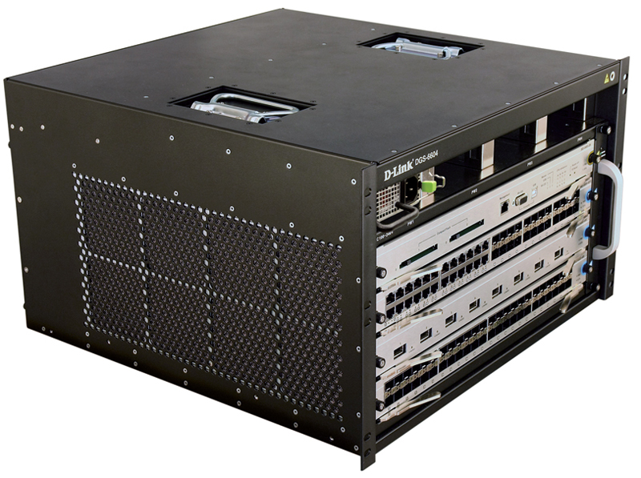

# Урок 7. Сетевые устройства

В предыдущих уроках вы познакомились со всеми уровнями модели TCP/IP — данные в ней обрастают заголовками, как снежный ком. Самое время познакомиться с сетевым оборудованием, которое использует сетевые протоколы для передачи данных. В рамках этого урока мы рассмотрим основные типы сетевого оборудования: коммутатор (свитч, хаб), маршрутизатор (он же роутер) и межсетевой экран (фаервол).


## Коммутатор

Коммутатор соединяет устройства в одной сети (как компьютеры в офисе или ваши устройства дома). Он знает, какое устройство подключено к какому порту, и отправляет информацию только туда, куда нужно. Если совсем упростить, то коммутатор - это как многопортовый удлинитель для интернета. Он берёт интернет из одного места (например, из роутера) и раздаёт его сразу нескольким устройствам (компьютерам, принтерам, телевизорам) в вашей сети.

<p align="center">

</p>

Представьте многоквартирный дом. Коммутатор - это почтальон внутри этого дома. Он знает, в какую квартиру нужно доставить каждое письмо и не разносит его всем подряд. Он знает, что "Компьютер А" живет в квартире "Порт 1", а "Компьютер Б" - в квартире "Порт 2".

Коммутаторы различаются по многим параметрам, в рамках этого урока мы расскажем про основные типы коммутаторов, но не про все, чтобы вас не напугать и хватило времени рассказать про маршрутизаторы и межсетевые экраны.

Начнём с  с конструктивных особенностей. Коммутаторы различаются:

- по количеству портов. Как правило от 4 до 48+

<p align="center">

</p>

- по способу монтажа. Стоечные (Rack mount), настольные. Стоечные оснащены специальными пластинами(ушами) с помощью которых коммутаторы устанавливаются в серверную стойку:

<p align="center">

</p>

- модульные коммутаторы. Эти коммутаторы имеют шасси, в которое можно устанавливать различные модули, такие как портовые модули, модули питания, модули управления и т.д.

<p align="center">

</p>

- Коммутаторы с возможностью стекирования (Stackable Switches). Эти коммутаторы можно соединять вместе с помощью специальных кабелей (стековых кабелей) для создания одного логического коммутатора. Это позволяет увеличить количество портов и повысить производительность.

- по типу портов. Обычно используются порты RJ-45, но так же бывают оптические свитчи (SFP), и комбинированные свитчи с RJ45 и SFP.

- по скорости передачи данных портов. 10 мбит\сек, 100 мбит\сек, 1 Гбит\сек.

С визуальной частью разобрались, полезли "под капот". 

Коммутатор работает на канальном уровне (Layer 2) модели OSI. Его основная задача — пересылать данные (кадры) между устройствами в локальной сети (LAN). Он делает это, используя MAC-адреса устройств. Процесс выглядит примерно так:

1. Коммутатор получает кадр данных на одном из своих портов.
2. Коммутатор смотрит на MAC-адрес назначения в заголовке кадра.
3. Коммутатор ищет MAC-адрес назначения в своей CAM-таблице (Content Addressable Memory).
4. Пересылка или широковещание:
  •  Если MAC-адрес найден: Коммутатор пересылает кадр только на тот порт, который связан с этим MAC-адресом. Это называется одноадресной пересылкой (unicast).
  •  Если MAC-адрес не найден: Коммутатор рассылает кадр на все порты, кроме порта, с которого он пришел. Это называется широковещательной пересылкой (broadcast). Это происходит, например, когда устройство впервые появляется в сети и коммутатор еще не знает, на каком порту оно находится.
5. Коммутатор также "учится", добавляя MAC-адреса отправителей из входящих кадров в свою CAM-таблицу, связывая их с портом, на который пришел кадр.

Немного подробнее остановимся на CAM-таблице (Content Addressable Memory), так как это важный момент в работе коммутатора.

Получив пакет, коммутатор анализирует MAC-адрес источника в этом пакете и затем использует его для обновления CAM-таблицы. Она помогает коммутатору оптимизировать пересылку данных, избежать ненужного широковещательного трафика.

Вот как происходит заполнение CAM-таблицы:

При получении кадра коммутатор проверяет MAC-адрес источника → Если MAC-адреса нет в CAM-таблице, он добавляет его и ассоциирует с портом, через который пришёл кадр → Когда нужно отправить данные на MAC-адрес, коммутатор использует CAM-таблицу, выявляя через неё нужный порт для доставки.

Допустим, у нас есть коммутатор с тремя подключёнными узлами:

Узел A с MAC-адресом AA:AA:AA:AA:AA:AA подключён к порту 1 коммутатора.

Узел B с MAC-адресом BB:BB:BB:BB:BB:BB подключён к порту 2 коммутатора.

Узел C с MAC-адресом CC:CC:CC:CC:CC:CC подключён к порту 3 коммутатора.


Когда узел A отправляет пакет через коммутатор, в CAM-таблицу попадает запись вида узел с MAC-адресом AA:AA:AA:AA:AA:AA подключен к 1 порту. Если узел B отправит пакет устройству A, коммутатор обновит свою таблицу и запишет, что узел B с MAC-адресом BB:BB:BB:BB:BB:BB подключён к порту 2.

Затем он сверится с таблицей вновь и увидит, что узел A находится на первом порту, и сразу отправит пакет туда. Если записи в CAM-таблице не будет (к примеру, узел A отправит пакет узлу C), коммутатор отправит пакет на все порты.

По своим функциональным особенностям коммутаторы в первую очередь делятся на неуправляемые и управляемые коммутаторы.

Неуправляемый коммутатор - это самый простой тип сетевого коммутатора. Он работает по принципу "подключи и работай" (plug-and-play). Вам не нужно его настраивать, он просто соединяет устройства в локальной сети (LAN) и автоматически пересылает данные между ними.

Управляемый коммутатор — это сетевой коммутатор, который позволяет администратору сети настраивать, контролировать и управлять его работой. В отличие от неуправляемых коммутаторов, которые работают "из коробки" без какой-либо настройки, управляемые коммутаторы предоставляют широкий набор функций и возможностей для оптимизации производительности сети, обеспечения безопасности и управления трафиком.

Остановимя на основных функциях управляемых коммутаторов (дальше я их буду называть свитчами, потому что устал писать коммутатор) и для чего они нужны.

1. Способы управления:

•  Веб-интерфейс (GUI): Графический интерфейс, доступный через веб-браузер. Он обычно предоставляет удобный и интуитивно понятный способ настройки и управления коммутатором.

•  Интерфейс командной строки (CLI): Текстовый интерфейс, доступный через Telnet, SSH или консольный порт. CLI предоставляет более продвинутые возможности настройки и управления, но требует знания команд.

•  Протоколы управления: Поддержка протоколов управления, таких как SNMP, позволяет управлять коммутатором с помощью централизованных систем управления сетью.

2.  VLAN (Virtual LAN): Виртуальная локальная сеть. VLAN позволяет логически сегментировать физическую сеть на несколько виртуальных сетей. Устройства, находящиеся в разных VLAN, не могут общаться друг с другом напрямую, если не настроена маршрутизация между VLAN.

Коммутатор использует теги VLAN (VLAN IDs) для идентификации трафика, принадлежащего к определенной VLAN. Трафик, помеченный определенным VLAN ID, пересылается только на порты, настроенные для этой VLAN.

Пример: В офисе есть отделы продаж, разработки и бухгалтерии. Каждый отдел можно поместить в отдельную VLAN (VLAN 10 для продаж, VLAN 20 для разработки, VLAN 30 для бухгалтерии). Это позволяет ограничить доступ к ресурсам каждого отдела и повысить безопасность. Например, можно запретить компьютерам отдела продаж получать доступ к серверам бухгалтерии.

Преимущества: Улучшенная безопасность, упрощенное управление сетью, повышение производительности за счет ограничения широковещательного трафика.

3.  QoS (Quality of Service): Качество обслуживания. QoS позволяет приоритизировать трафик в сети, чтобы обеспечить лучшую производительность для критически важных приложений.

QoS использует различные механизмы для классификации трафика (например, на основе IP-адресов, номеров портов, VLAN IDs) и назначения ему приоритета. Коммутатор может использовать различные алгоритмы для управления очередями трафика и предоставления приоритетного обслуживания трафику с высоким приоритетом.

Пример: В сети используются IP-телефония и видеоконференции. Для обеспечения хорошего качества связи можно настроить QoS таким образом, чтобы трафик VoIP и видео имел высокий приоритет, а трафик загрузки файлов - низкий приоритет. Это гарантирует, что голосовые и видеозвонки не будут прерываться из-за перегрузки сети.

Преимущества: Улучшенное качество обслуживания для критически важных приложений, снижение задержек и потерь пакетов.

4.  Spanning Tree Protocol (STP): Протокол связующего дерева. STP предназначен для предотвращения образования петель в сети. Петли могут возникать, когда в сети есть несколько путей для передачи данных между двумя устройствами. STP автоматически обнаруживает петли и блокирует один или несколько путей, чтобы избежать циклического распространения трафика.

STP использует алгоритм, который выбирает один корневой коммутатор (Root Bridge) в сети. Все остальные коммутаторы определяют оптимальный путь до корневого коммутатора и блокируют избыточные соединения, которые могут привести к образованию петель.

Пример: В сети есть два коммутатора, соединенных двумя кабелями для обеспечения отказоустойчивости. Без STP это приведет к образованию петли. STP автоматически заблокирует один из кабелей, чтобы предотвратить петлю, но если основной кабель выйдет из строя, заблокированный кабель будет автоматически активирован.

Преимущества: Предотвращение петель, обеспечение отказоустойчивости.

5.  Link Aggregation (LAG) / Port Channeling: Агрегирование каналов. LAG позволяет объединить несколько физических портов в один логический канал, увеличивая пропускную способность и обеспечивая отказоустойчивость.

LAG использует протоколы, такие как LACP (Link Aggregation Control Protocol), для автоматического обнаружения и настройки агрегированных каналов. Трафик распределяется между физическими портами в канале, увеличивая общую пропускную способность. Если один из портов выходит из строя, трафик автоматически перенаправляется на другие порты в канале.

Пример: Сервер подключен к коммутатору двумя гигабитными каналами. Объединив эти два канала в LAG, можно получить пропускную способность 2 Гбит/с. Если один из каналов выйдет из строя, сервер продолжит работать на скорости 1 Гбит

Преимущества: Увеличение пропускной способности, отказоустойчивость.

Более подробно про настройку свитчей поговорим в следующих темах, сейчас же пройдём небольшой квиз и расскажем про маршрутизаторы(я их буду называть роутеры, ещё раздел не начался, а я уже сдаюсь, но мне коммутаторов хватило))

## Квиз 1

Ниже перечислены особенности коммутаторов. Вам нужно выбрать к какому типу коммутаторов они относятся: управляемые, неуправляемые, оба.

1. Отсутствие конфигурации.

а. управляемые

б. неуправляемые (верно)

в. оба

2. Использование MAC-адресов

а. управляемые

б. неуправляемые 

в. оба (верно)

3. Физические порты

а. управляемые

б. неуправляемые 

в. оба (верно)

4. Поддержка VLAN

а. управляемые (верно)

б. неуправляемые 

в. оба

## Маршрутизатор

Маршрутизатор соединяет разные сети (например, вашу домашнюю сеть с Интернетом). Он выбирает лучший маршрут для передачи данных между этими сетями. Он как навигатор, который говорит, куда нужно ехать, чтобы попасть в нужное место.

Визуально свитчи и роутеры могут быть очень похожи, но, как правило, у роутеров меньше портов. В остальном конструктивные особенности очень схожи, если не идентичны. 

<p align="center">

</p>

Но, в отличии от свитчей, роутер может быть реализован в качестве виртуальной машины, так как его задача маршрутизировать трафик, а не "соединять" между собой устройства.

Для выполнения своих задач он использует **таблицу маршрутизации**, которая содержит соответствие IP-адресов и интерфейсов, через которые нужно отправить пакет. 

Представим, что у нас есть сеть:


И в ней — две разные подсети: `192.168.1.0/24` и `192.168.2.0/24`. В таком случае таблица на маршрутизаторе будет выглядеть следующим образом:

```c
Назначение        Шлюз             Маска            Интерфейс
192.168.1.0/24     -                255.255.255.0    eth0
192.168.2.0/24     -                255.255.255.0    eth1
```

Когда пакет из первой подсети попадёт на маршрутизатор, запустится алгоритм:

1. Получение пакета данных. Когда ваше устройство (компьютер, смартфон и т.д.) отправляет данные в другую сеть (например, на веб-сайт в интернете), данные разбиваются на небольшие "пакеты". Этот пакет содержит информацию, куда он должен быть доставлен (адрес назначения, или IP-адрес). Пакет отправляется на роутер.

2. Анализ адреса назначения. Роутер смотрит на адрес назначения в пакете (IP-адрес). IP-адрес имеет иерархическую структуру, позволяющую определить, к какой сети принадлежит получатель.

3. Таблица маршрутизации. Роутер использует таблицу маршрутизации (routing table) – это как карта, показывающая, куда нужно отправить пакет, чтобы он добрался до места назначения. Таблица маршрутизации содержит информацию о различных сетях и наилучших путях к ним. Пути могут быть связаны с конкретными интерфейсами самого роутера (куда подключены другие сети или другие роутеры). Если роутер знает, как добраться до сети назначения (т.е., запись есть в таблице), он определяет следующий "прыжок" (next hop) – следующий роутер, которому нужно отправить пакет.

4. Пересылка пакета. Роутер пересылает пакет на интерфейс, указанный в таблице маршрутизации, направляя его к следующему "прыжку". Этот процесс повторяется на каждом роутере по пути, пока пакет не достигнет сети назначения.

>[На подложке] Пакет, отправленный с ПК 1 с адресом `192.168.1.7`, придёт на маршрутизатор через интерфейс `eth 0`. Адрес его назначения — `192.168.2.4` с маской `24`, то есть ПК 2. 
>
> маршрутизатор сверится с таблицей и отправит пакет на интерфейс `eth1`.

Есть ещё один важный компонент:

>[На подложке: a2c0c5] Для операций по маршрутизации предназначен специальный аппаратный модуль — **ASIC** (от англ. Application-Specific Integrated Circuit — «интегральная схема для конкретного применения»). Это микросхема, которая берёт на себя часть задач и снимает нагрузку с процессора сетевого оборудования. 

ASIC оптимизирован для обработки сетевых пакетов, что значительно ускоряет его работу по сравнению с общим процессором маршрутизатора.

[Кнопка] Узнать про файрвол

## Файрвол

>[На подложке: a2c0c5] Ещё одно важное устройство в сетевой архитектуре — **межсетевые экраны** (англ. firewalls, также используется название «брандмауэр»), предназначенные для контроля и фильтрации сетевого трафика. 
>
> Они работают на аппаратном уровне и обычно используются для защиты корпоративных сетей от угроз — хакерских атак, вирусов, вредоносного ПО и других. 

>[Реплика героя курса] Конечно, есть и программные решения, но они уступают аппаратным в производительности.


Проходящий через сетевой экран трафик обрабатывается по специальным правилам — они определяют, пропускать его или нет. Обычно правило выглядит как условие и действие, которое необходимо совершить: например, при обращении к `22` порту запрещать трафик.

Есть также усовершенствованные версии файрволов с более широким спектром функций и возможностей для обеспечения безопасности сети — **NGFW** (от англ. Next-Generation Firewall — «файрвол следующего поколения»). 

Основной упор в них — не только на фильтрации пакетов и контроле доступа на уровне портов и протоколов, как у традиционных межсетевых экранов, но и на глубоком анализе сетевого трафика.

Пройдёмся по возможностям NGFW:

1. **Продвинутый контроль приложений:** способность распознавать их в сетевом трафике и применять правила безопасности на уровне приложений, а не только портов.

1. **Глубокий анализ трафика**, включая декодирование SSL-трафика, обнаружение вредоносного ПО и предотвращение передачи угрожающих файлов.

2. **Обнаружение и предотвращение атак в реальном времени**, таких как DDoS атаки, фишинг, SQL-инъекции и прочих.

### Подведём итоги

С аппаратной точки зрения сетевое оборудование задействовано на всех уровнях модели TCP/IP. Такие устройства оснащаются специальными микросхемами — у коммутаторов и маршрутизаторов это ASIC. 

Как в коммутаторах, так и в маршрутизаторах есть таблицы — CAM и маршрутизации, а ещё протоколы для борьбы с широковещательными штормами, или сетевыми петлями. Безопасность в сети обеспечивает отдельное многофункциональное устройство — межсетевой экран, или файрвол.
