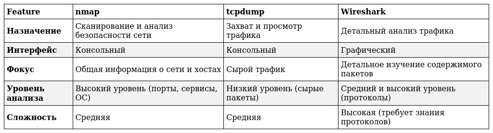
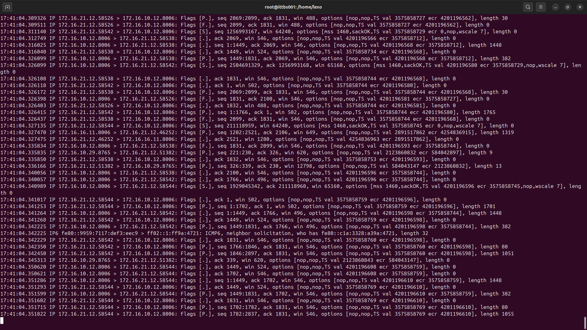
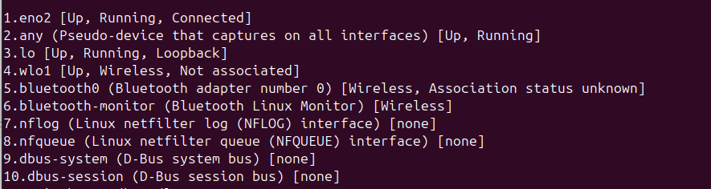

# Введение в анализ и диагностику сетевого трафика.

#### Прим. автора Название урока изменил, так как новое название лучше отражает суть урока. С Максимом согласовал.

Прошлые темы были  посвящены сетям, сетевой архитектуре и протоколам. Вы узнали какие бывают протоколы, для чего они нужны, к какому уровню модели OSI относятся, какие бывают топологии сетей, как настраивать коммутаторы, познакомились с основами маршрутизации. 

Даже если вы настроили всё верно и вчера сеть и система в целом работала, как задумано, то это не значит, что сегодня будет так же как вчера. Есть масса факторов, которые могут повлиять на работу сети. И как и с помощью чего обнаружить эти неполадки мы расскажем в этой теме.

Эта тема посвещена введению в анализ и диагностику сетевого трафика. В этом уроке мы расскажем и покажем как и с помощью чего можно обнаружить неполадки в сети.Например: сервис или сетевое оборудование, которое вышло из строя полностью или частично; пользователи, которые могли создать подобную ситуацию неумышленно или умышленно. 

В этой теме мы даём основы анализа для того, чтобы находить и устранять неисправности, а не обнаруживать и пресекать вторжения в систему, для этого существуют отдельные курсы, в которых рассматриваются методы и инструменты тестирования уязвимостей и их предотвращения. Иными словами, это урок ОБЖ, а не самообороны.

Прежде чем мы перейдем к анализу сетевого трафика, обратим ваше внимание, что нередки случаи, что недоступность хоста (компьютер, принтер, коммутатор) может быть вызвана физическим взаимодействием пользователя\ сотрудника с оборудованием: уборщица убиралась в плохом настроении, сотруднику мешал ненужный провод из стены, срочно нужно было зарядить телефон, а свободных розеток не было в доступности. 

Даже если пользователь говорит, что никто ничего не трогал и “оно само”, стоит убедиться в этом лично.

В рамках этой темы мы расскажем вам про 3 основные инструмента для диагностики и анализа сетевого трафика, про 1 в этом уроке и 2 в следующем : 

**1.** Начнём с tcpdump. Tcpdump - это консольная утилита, представляющая собой анализатор пакетов . Она позволяет захватывать и отображать пакеты, передаваемые по сети, к которой подключен компьютер. Важно понимать, что tcpdump не изменяет трафик, а только наблюдает за ним.

Обычно tcpdump уже предустановлен в ОС Ubuntu, если нет, то это можно исправить следующими командами:
```
sudo apt update
sudo apt install tcpdump
```

Если консоль будет задавать дополнительные вопросы введите: `y` - yes.

Для использования tcpdump обычно требуются права суперпользователя (root), поэтому используйте sudo.

**2.** Wireshark — это бесплатный анализатор пакетов с открытым исходным кодом. Он позволяет захватывать и интерактивно просматривать трафик, проходящий по компьютерной сети. 
	
Устанавливаем так же:
```
sudo apt update
sudo apt install wireshark
```

Если консоль будет задавать дополнительные вопросы введите: `y` - yes.

**3.** Nmap (Network Mapper) - это утилита с открытым исходным кодом, предназначенная для сканирования и анализа сетей. Она позволяет обнаруживать хосты в сети, определять их операционные системы и запущенные сервисы, а также выявлять открытые порты и потенциальные уязвимости. Nmap является одним из наиболее популярных и широко используемых инструментов в области сетевой безопасности.

Установка Nmap мало чем отличается от установки tcpdump. Откройте терминал и выполните следующие команды:
```
sudo apt update
sudo apt install nmap
```

Если консоль будет задавать дополнительные вопросы введите: `y` - yes.

Может создаться впечатление, что мы будем использовать 3 одинаковых программы.

<p align="center">

</p>

Это не совсем так, хоть функционал их во многом дублируется, но особенности есть, они представлены в таблице ниже:

<p align="center">

</p>

Когда что использовать:

•  tcpdump: Когда вам нужно быстро захватить трафик и посмотреть, что происходит в сети в реальном времени, или когда нужен минимальный overhead.

•  nmap: Когда вам нужно получить общее представление о сети, определить открытые порты или проверить безопасность.

•  Wireshark: Когда вам нужно детально проанализировать трафик, разобраться в сложном протоколе или отладить сетевое приложение. 

Если совсем упростить, то nmap сканирует сеть, tcpdump захватывает трафик, а Wireshark помогает его анализировать. Они дополняют друг друга и часто используются вместе для решения сетевых задач.

Добавим, что Wireshark и nmap существуют и для Linux,  и для Windows. В рамках этой темы мы рассмотрим как их использовать для Linux, а конкретнее для ОС Ubuntu.

С вводной частью закончили, перейдём к практике.  

### Практика 1.

Ранее вы уже устанавливали Ubuntu в VirtualBox, если вы уже удалили эту виртуальную машину, установите заново по инструкции, которая у вас есть, плюс с помощью команд, которые мы рассмотрели в этом уроке, установите через терминал tcpdump, wireshark, nmap.

На данном этапе у вас уже есть ВМ с ОС Ubuntu и установлены нужные нам инструменты.


## Tcpdump

Давайте проанализируем трафик с помощью tcpdump.Откройте терминал и введите tcpdump (конечно же, с sudo, вы же помните). Перед вами откроется подобный неинформативный “поток сознания”:

<p align="center">

</p>

Как же это нам может помочь? Дьявол кроется в деталях, в нашем случае в опциях. Давайте разбираться. Для начала нажмите 'Ctrl+C', для прекращения “потока сознания”.

Сначала посмотрим список “доступных” интерфейсов с помощью опции `-D`, то есть `tcpdump -D`, либо `tcpdump --list-interfaces`, про sudo уже не упоминаю, вы же запомнили? В ответ мы получим список интерфейсов:

<p align="center">

</p>

Для перехвата трафика через определённый интерфейс используется опция `-i` и имя интерфейса.  То есть, если мы хотим перехватить трафик, который идёт через интерфейс eno2, то команда будет выглядеть : `tcpdump - i eno2`. Но и в этом случае информации будет слишком много, поэтому перейдём к основным опциям и фильтрам.
 
Начнём с опций, мы рассмотрим только самые основные, с полным списком вы можете ознакомиться в документации к этой утилите, например по адресу: https://www.tcpdump.org/manpages/tcpdump.1.html , в примерах будут использоваться и фильтры, речь о них пойдёт дальше, не заостряйте на них сейчас своё внимание. 
Для лучшей наглядности и, чтобы проникнуться данной утилитой и её опциями, попробуйте повторить предложенные ниже примеры на своей ВМ, не забывая указывать свои имена интерфейсов. 

Опции:


`-n`: Отключение преобразования имен хостов и сервисов.

По умолчанию, tcpdump пытается преобразовать IP-адреса в имена хостов (через DNS) и номера портов в названия сервисов (например, 80 -> http, 22 -> ssh). Опция -n отключает эти преобразования, что делает вывод более быстрым и предсказуемым. Особенно полезно, если у вас проблемы с DNS или вы хотите избежать лишних сетевых запросов. Иногда, DNS не работает или работает медленно, что приводит к зависанию tcpdump.

Пример:

```
    sudo tcpdump -i eth0 -n host 192.168.1.100 # Отображает IP-адрес вместо имени хоста
```

Без -n, tcpdump попытается выполнить DNS lookup для 192.168.1.100, что может занять время или не сработать.

`-nn`: Дополнительно отключает преобразование номеров портов в названиях сервисов.

Пример:
```
    sudo tcpdump -i eth0 -nn port 53  # Показывает номер порта 53 вместо "domain"
```

Без `-nn`, вывод может показать "domain" (DNS) вместо "53", что требует дополнительного преобразования.

 `-v, -vv, -vvv`: Управление уровнем детализации вывода
Управляет уровнем детализации вывода. -v (verbose) добавляет немного больше информации, -vv еще больше, а -vvv максимально детализированный вывод. Чем выше уровень детализации, тем больше информации о пакетах будет отображено. Это может быть полезно для более глубокого анализа, но также может сделать вывод более сложным для чтения.

Пример:

```
    sudo tcpdump -i eth0 -v tcp port 80 # Более подробная информация о TCP-пакетах на порту 80
```

С каждым дополнительным v, вы увидите больше деталей о заголовках пакетов, флагах TCP, опциях и т.д.

` -w <file>`: Запись захваченного трафика в файл
Записывает захваченные пакеты в файл в формате pcap (packet capture).  Этот формат является стандартным для анализа сетевого трафика и может быть открыт в Wireshark и других инструментах.  Использование `-w` позволяет сохранить трафик для последующего анализа, что особенно полезно для решения проблем, которые трудно воспроизвести в реальном времени.

Пример:
```
    sudo tcpdump -i eth0 -w capture.pcap tcp port 80 # Записывает трафик TCP на порту 80 в файл capture.pcap
```

Файл capture.pcap можно потом открыть в Wireshark для более удобного анализа. Подробнее об этом расскажем дальше.

` -r <file>`: Чтение трафика из файла
Читает захваченный трафик из файла pcap (созданного с помощью `-w`).  Позволяет анализировать сохраненный трафик, не захватывая его в реальном времени. 

Пример:
```
    sudo tcpdump -r capture.pcap # Отображает содержимое файла capture.pcap на экране
```

`-c <count>`: Ограничение количества захватываемых пакетов,может быть полезной, чтобы не перегружать систему.

Пример: 

```
    sudo tcpdump -i eth0 -c 100 tcp port 80 # Захватывает только 100 пакетов TCP на порту 80
```

tcpdump завершит работу после захвата 100 пакетов, что удобно для тестов или отладки.

`-s <snaplen>`:  Указание длины захватываемых данных пакета (snaplen)

Пример:
```
    sudo tcpdump -i eth0 -s 100 tcp port 80 # Захватывает только первые 100 байтов каждого TCP-пакета на порту 80
```

`-q` : Тихий режим. В тихом режиме выводится меньше информации о каждом пакете.

Пример:

    sudo tcpdump -i eth0 -q tcp port 80

-t, -tt, -ttt, -tttt, -ttttt: Управление временными метками для вывода их в различных форматах. Эти опции позволяют более тонко коррелировать информацию с другими логами.

Пример:
```
    sudo tcpdump -i eth0 -tttt tcp port 80
```

Вывод будет содержать временные метки в виде чисел, представляющих количество секунд, прошедших с 1 января 1970 года.

`-e`: Показ MAC-адресов Ethernet

Пример:
```
    sudo tcpdump -i eth0 -e host 192.168.1.100
```
Вывод будет включать MAC-адреса устройств, отправляющих и получающих пакеты.

`-X` и `-XX`: Отображение содержимого пакетов в шестнадцатеричном и ASCII форматах.

Пример: 

```
    sudo tcpdump -i eth0 -X tcp port 80 # Отображает содержимое TCP-пакетов на порту 80 в шестнадцатеричном и ASCII форматах.
```

Это позволит увидеть данные, передаваемые по протоколу HTTP.

`-dd`: Вывод BPF-кода (фильтра)
Эта опция очень полезна при отладке сложных фильтров. Она выводит байт-код, скомпилированный из выражения фильтрации. Это позволяет увидеть, как tcpdump интерпретирует фильтр, и выявить возможные ошибки.

Пример:
```
    sudo tcpdump -i eth0 -dd tcp port 80
```  
Вывод будет представлять собой набор инструкций BPF (Berkeley Packet Filter), которые tcpdump использует для фильтрации трафика.

Эти опции – лишь верхушка айсберга, но они являются основой для эффективного использования tcpdump.

Фильтры:

1.  `host <hostname or IP>`: Фильтрация по хосту

Фильтрует пакеты, связанные с указанным хостом. Хост может быть указан как IP-адрес (например, 192.168.1.100) или имя хоста (например, www.example.com). Также можно дополнить src - исходящий трафик от хоста или dst - трафик предназначенный для хоста.
   	
Примеры:
```
        sudo tcpdump -i eth0 host 192.168.1.100  # Трафик, связанный с хостом 192.168.1.100
        sudo tcpdump -i eth0 host www.example.com  # Трафик, связанный с хостом www.example.com
        sudo tcpdump -i eth0 dst host 192.168.1.100 # Только трафик, *предназначенный* для хоста 192.168.1.100
```
2.  `net <network>`: Фильтрация по сети
Фильтрует пакеты, связанные с указанной сетью. Сеть указывается в формате IP-адрес/маска (например, 192.168.1.0/24).

Примеры:
```
        sudo tcpdump -i eth0 net 192.168.1.0/24  # Трафик, связанный с сетью 192.168.1.0/24
        sudo tcpdump -i eth0 src net 10.0.0.0/8     # Трафик, *исходящий* из сети 10.0.0.0/8
```
3.  `port <port number>`: Фильтрация по порту

Фильтрует пакеты, использующие указанный порт.  Порт может быть указан как число (например, 80) или имя сервиса (например, http).

Примеры:
```
        sudo tcpdump -i eth0 port 80        # Трафик, использующий порт 80
        sudo tcpdump -i eth0 port http      # То же самое, но с использованием имени сервиса
        sudo tcpdump -i eth0 dst port 22    # Трафик, *предназначенный* для порта 22 (SSH)
```
4.  `portrange <port1>-<port2>`: Фильтрация по диапазону портов

Фильтрует пакеты, использующие порты из указанного диапазона.

Примеры:
```
        sudo tcpdump -i eth0 portrange 1024-5000 # Трафик, использующий порты в диапазоне 1024-5000
```
5.  `proto <protocol>`: Фильтрация по протоколу

Фильтрует пакеты по указанному протоколу. Наиболее распространенные протоколы: tcp, udp, icmp, arp. Вместо proto можно указывать сразу название протокола (например, просто tcp).

Примеры:
```
        sudo tcpdump -i eth0 proto tcp  # Трафик TCP
        sudo tcpdump -i eth0 udp        # Трафик UDP (то же самое, что и "proto udp")
```

6.  `ether <filter>`: Фильтрация по Ethernet

Используется для фильтрации пакетов на уровне Ethernet, например, по MAC-адресу.

Подтипы фильтров ether:

        *   ether host <MAC>: Соответствие MAC-адресу источника или назначения.
        *   ether src <MAC>: Соответствие MAC-адресу источника.
        *   ether dst <MAC>: Соответствие MAC-адресу назначения.
        *   ether proto <protocol>: Соответствие типу протокола Ethernet.

Примеры:
```
        sudo tcpdump -i eth0 ether host 00:11:22:33:44:55   # Трафик с/на MAC-адрес 00:11:22:33:44:55
        sudo tcpdump -i eth0 ether src 00:11:22:33:44:55    # Трафик, *исходящий* с MAC-адреса 00:11:22:33:44:55
        sudo tcpdump -i eth0 ether dst 00:11:22:33:44:55    # Трафик, *предназначенный* для MAC-адреса 00:11:22:33:44:55
```

7. `len <length>`: Фильтрация по длине пакета

Фильтрует пакеты по их общей длине (в байтах).
Примеры:
```
      sudo tcpdump -i eth0 len > 1000      # Пакеты длиной более 1000 байт
      sudo tcpdump -i eth0 len <= 64      # Пакеты длиной не более 64 байт (минимальная длина пакета Ethernet)
```

Так же tcpdump позволяет использовать сложные фильтры с помощью логических операторов:

•  `and` или `&&`: Логическое "И". Оба условия должны быть истинными.

•  `or` или `||`: Логическое "ИЛИ". Хотя бы одно из условий должно быть истинным.
•  `not` или `!`: Логическое "НЕ". Инвертирует условие.


Примеры использования логических операторов:

1. Трафик от хоста 192.168.1.100 И на порт 80:
```
    sudo tcpdump -i eth0 src host 192.168.1.100 and dst port 80
    sudo tcpdump -i eth0 src host 192.168.1.100 && dst port 80  # То же самое, с использованием "&&"
```
2. Трафик на хост 192.168.1.100 ИЛИ на порт 80:
```
    sudo tcpdump -i eth0 dst host 192.168.1.100 or dst port 80
```
3. Трафик TCP ИЛИ UDP на порту 53 (DNS):

```
    sudo tcpdump -i eth0 '(tcp port 53) or (udp port 53)'
    sudo tcpdump -i eth0 'port 53 and (tcp or udp)'     #Более короткий вариант
```

Обратите внимание на использование скобок ( ) для группировки условий. Они важны для правильной интерпретации фильтра.

Дополнительные советы:

•  Используйте скобки для явного указания приоритета операторов: Когда используете сложные выражения, скобки помогают избежать неоднозначности.

•  Помните о порядке применения фильтров: tcpdump применяет фильтры слева направо, учитывая приоритет операторов.

•  Тестируйте свои фильтры: Перед тем, как использовать фильтр для захвата большого объема трафика, убедитесь, что он работает правильно.

•  Не забывайте про кавычки (''): Если фильтр содержит специальные символы (пробелы, (, ), !, > и т.д.), его необходимо заключить в одинарные кавычки.

Примеры комбинированных фильтров:

1. Захват трафика TCP от хоста 192.168.1.100 на порт 80 или 443:
```
    sudo tcpdump -i eth0 'tcp and src host 192.168.1.100 and (dst port 80 or dst port 443)'
```
2. Захват трафика ICMP (пинги) НЕ от хоста 192.168.1.1:
```
    sudo tcpdump -i eth0 'icmp and not src host 192.168.1.1'
```

### Практика 2.

#### Задание 1:

Составьте фильтр для tcpdump, который будет захватывать весь трафик TCP с интерфейса eth0, идущий(dst) к серверу с IP-адресом 192.168.1.10. 

[скрыть под тогглом]

Правильный ответ:
```
sudo tcpdump -i eth0 tcp and dst host 192.168.1.10
```

Объяснение:

•   tcp:  Ограничивает захват только TCP-трафиком.
•   dst host 192.168.1.10: Указывает, что мы интересуемся трафиком, направленным к хосту с IP-адресом 192.168.1.10 (серверу).


#### Задание 2:

Настройте tcpdump так, чтобы он перехватывал весь трафик UDP интерфейса eth0, исходящий с портов в диапазоне от 5000 до 5010, но только в том случае, если он направлен на сеть 10.0.0.0/24.

[скрыть под тогглом]

Правильный ответ:
```
sudo tcpdump -i eth0 'udp and src portrange 5000-5010 and dst net 10.0.0.0/24'
```

Объяснение:

•   udp: Фильтруем только UDP-трафик.
•   src portrange 5000-5010: Указываем диапазон исходящих портов, которые нас интересуют (5000-5010).
•   dst net 10.0.0.0/24: Ограничиваем трафик, направленный в сеть 10.0.0.0/24.

#### Задание 3:

Предположим, вы хотите отследить ARP-трафик, связанный с устройством, имеющим MAC-адрес 00:11:22:33:44:55.  Как настроить tcpdump для этой цели?

[скрыть под тогглом]

Правильный ответ:
```
sudo tcpdump -i eth0 'arp and ether host 00:11:22:33:44:55'
```

Объяснение:

•   arp: Фильтруем только ARP-трафик.
•   ether host 00:11:22:33:44:55: Указывает, что мы ищем ARP-трафик, связанный с MAC-адресом 00:11:22:33:44:55, будь то MAC-адрес отправителя или получателя ARP-пакета.

#### Задание 4:

Составьте фильтр, который будет отслеживать весь трафик ICMP (пинги), за исключением трафика, исходящего от вашего маршрутизатора, IP-адрес которого 192.168.1.1.

[скрыть под тогглом]

Правильный ответ:
```
sudo tcpdump -i eth0 'icmp and not src host 192.168.1.1'
```

Объяснение:

•   icmp:  Фильтруем только ICMP-трафик.
•   not src host 192.168.1.1: Исключаем весь трафик, исходящий от хоста с IP-адресом 192.168.1.1 (маршрутизатора).  not инвертирует условие src host.

#### Задание 5:

Вам нужно захватить все пакеты, размер которых превышает 1000 байт, независимо от протокола, но только на интерфейсе enp0s3.

[скрыть под тогглом]

Правильный ответ:
```
sudo tcpdump -i enp0s3 'len > 1000'
```

Объяснение:

•   -i enp0s3:  Указывает интерфейс enp0s3 для захвата трафика.
•   len > 1000:  Указывает, что мы интересуемся пакетами, длина которых превышает 1000 байт.  Важно отметить, что этот фильтр работает на уровне IP, а не на уровне Ethernet.
