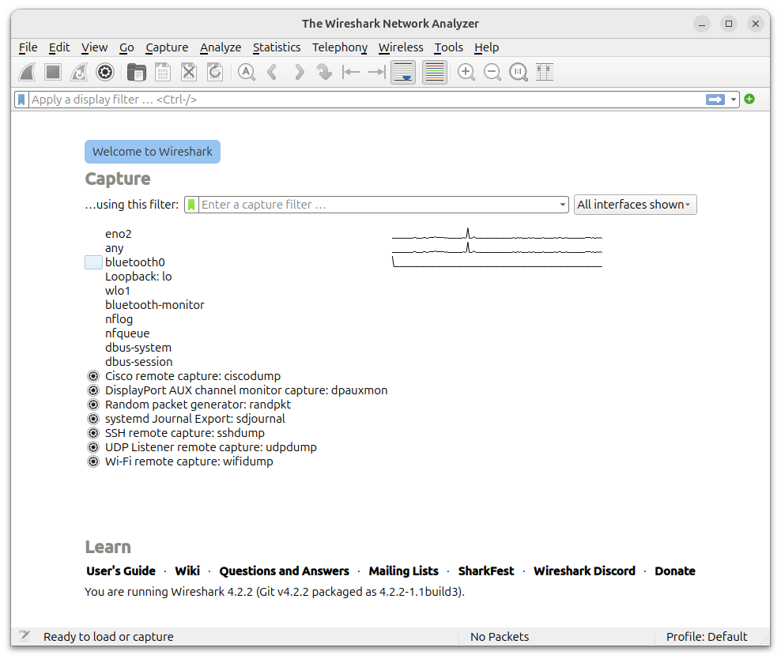
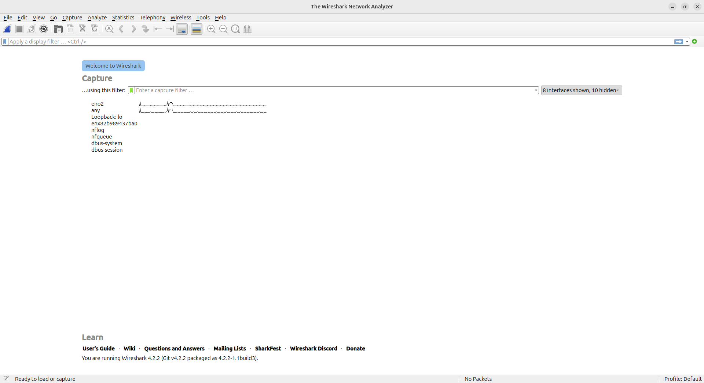
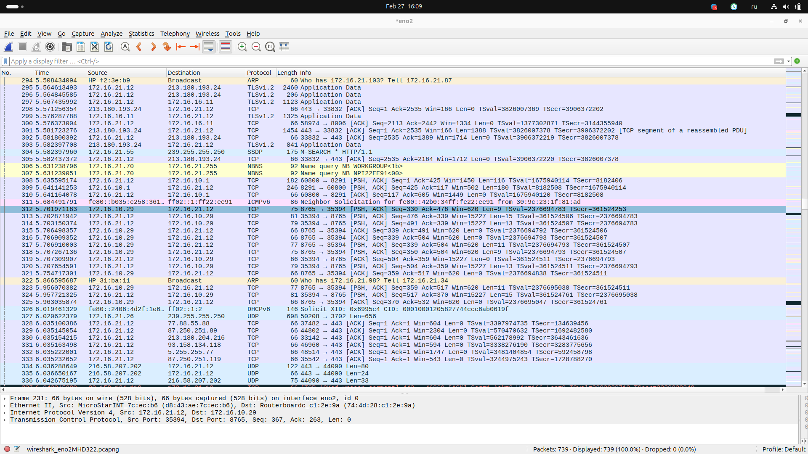
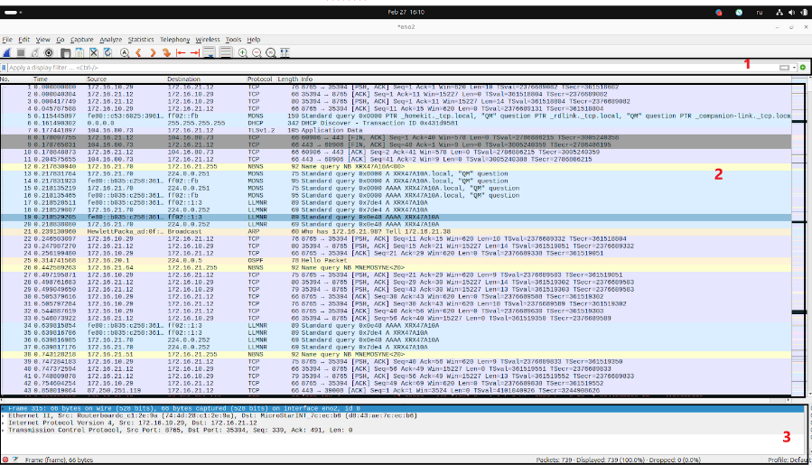
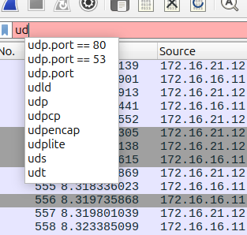
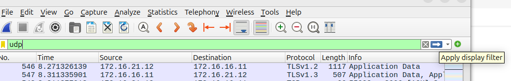
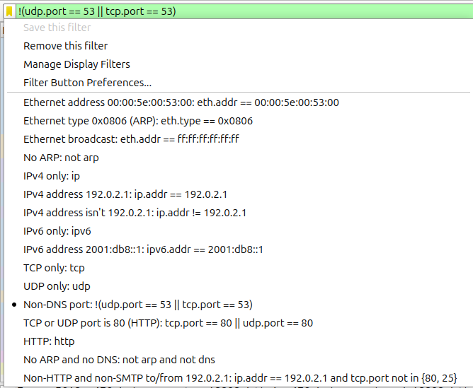

# Введение в анализ и диагностику сетевого трафика.Nmap и Wireshark.

В прошлом уроке вы уже узнали для чего нужен анализ трафика и какие для этого используются инструменты. Кроме того, вы научились пользоваться tcpdump'ом, узнали его основные опции и фильтры. В этом уроке мы сконцентрируемся на NMAP и Wireshark, но для финальной практики понадобятся знания из прошлого урока. Начнём!

## Nmap

Напомним, что такое Nmap и как его установить:

Nmap (Network Mapper) - это утилита с открытым исходным кодом, предназначенная для сканирования и анализа сетей. Она позволяет обнаруживать хосты в сети, определять их операционные системы и запущенные сервисы, а также выявлять открытые порты и потенциальные уязвимости. Nmap является одним из наиболее популярных и широко используемых инструментов в области сетевой безопасности.

Установка Nmap. Откройте терминал и выполните следующие команды:

```
sudo apt update
sudo apt install nmap
```

Если консоль будет задавать дополнительные вопросы введите: `y` - yes.

Для лучшей наглядности и, чтобы проникнуться данной утилитой и её опциями, попробуйте повторить предложенные ниже примеры на своей ВМ, не забывая указывать свои имена интерфейсов. 

##### Опции:

1. Целеуказание (Target Specification):  Указывает цель сканирования. Может быть IP-адрес, доменное имя, сеть или список целей из файла.

Пример:

``` 
nmap scanme.nmap.org  - Сканирование одного хоста (доменное имя).
nmap 192.168.1.1 - Сканирование одного хоста (IP-адрес).
nmap 192.168.1.1-100 - Сканирование диапазона IP-адресов.
``` 

2. Типы сканирования (Scan Techniques):

•   -sS (TCP SYN scan):  Самый популярный и эффективный метод сканирования. Отправляет SYN пакеты (SYN-пакет (от англ. Synchronize) - это специальный тип пакета в протоколе TCP (Transmission Control Protocol), который используется для установления TCP-соединения между двумя устройствами.) и анализирует ответы (SYN/ACK для открытых портов, RST для закрытых). Требует root-привилегий.


•   -sT (TCP connect() scan):  Использует системный вызов connect(). Не требует root-привилегий, но более медленный, чем SYN scan.

•   -sU (UDP scan):  Сканирование UDP портов. Медленный и ненадежный, так как UDP не гарантирует доставку пакетов.

•   -sV (Version detection):  Определяет версию сервисов, работающих на открытых портах.

•   -p <port ranges>: Указывает, какие порты сканировать.  Может быть отдельным портом, диапазоном или списком.

Примеры:

```
nmap -sS scanme.nmap.org - TCP SYN scan (по умолчанию сканирует 1000 наиболее популярных TCP портов).

nmap -sU scanme.nmap.org - UDP scan (сканирует 1000 наиболее популярных UDP портов).

nmap -sV scanme.nmap.org - Определение версий сервисов на открытых портах.

nmap -p 80,443,22 scanme.nmap.org - Сканирование портов 80, 443 и 22.

nmap -p 1-100 scanme.nmap.org - Сканирование портов с 1 по 100.

```

3. Обнаружение хоста (Host Discovery):

•   -sn (Ping scan): Только проверяет, активны ли хосты в сети, не сканируя порты. Быстрый способ определить, какие хосты включены.

•   -Pn (No ping):  Пропускает этап обнаружения хоста и предполагает, что все цели активны.  Полезно, если брандмауэр блокирует ICMP (ping) запросы.

Примеры:

```
nmap -sn 192.168.1.0/24 -  Проверка активности хостов в сети 192.168.1.0/24 (Ping scan).
nmap -Pn scanme.nmap.org - Сканирование scanme.nmap.org без предварительного пинга.
```

5. Вывод (Output):

•   -oN <filename>:  Сохраняет результаты сканирования в файл в обычном текстовом формате.

•   -oX <filename>:  Сохраняет результаты сканирования в файл в XML формате.

•   -v (Verbose):  Включает подробный вывод.  Используйте -vv для еще более подробного вывода.

•   -d (Debugging): Включает отладочный вывод (для разработчиков и отладки проблем).

Примеры:

```
nmap -oN results.txt scanme.nmap.org - Сохранение результатов в results.txt в обычном формате.
nmap -oX results.xml scanme.nmap.org - Сохранение результатов в results.xml в XML формате.
```

6. Прочее:

•   -F (Fast scan):  Сканирует только 100 наиболее популярных портов.

•   -O (OS detection):  Попытка определить операционную систему удаленного хоста.  Требует root-привилегий.

Это основные опции nmap, с полным списком вы можете ознакомиться в документации к этой утилите в Интернете. Перейдём к практике.

### Практика 1.

####  Задание 1:

•  Ситуация: В вашей сети 192.168.1.0/24 необходимо обнаружить все хосты, у которых работает веб-интерфейс на 80 и 443 порту.
•  Задача: Составьте команду Nmap, которая обнаружит хосты с открытыми портами 80 или 443. Сохраните результаты в XML файл.

[скрыть под тогглом]

> Решение:
> ```
>   nmap 192.168.1.0/24 -p 80,443  -oX web_hosts.xml 192.168.1.0/24
> ```
> 
>   Объяснение:
> 
> 192.168.1.0/24: Указывает целевую сеть для сканирования (замените на вашу сеть).
> 
> -p 80,443: Указывает Nmap сканировать только порты 80 и 443.
> 
> -oX apache_hosts.xml: Сохраняет результаты сканирования в XML файл с именем apache_hosts.xml. XML формат > > удобен для автоматической обработки данных.
   

#### Задание 2:

•  Ситуация: Вы хотите узнать, какие из стандартных портов (1-1000) открыты на веб-сервере webserver.example.com.

•  Задача: Выполните быстрое сканирование TCP портов с 1 по 1000 на указанном хосте, используя SYN-сканирование.

[скрыть под тогглом]
> Решение:
> ```    
> nmap -sS -p 1-1000 webserver.example.com
> ```
> или
> ```
>     nmap -sS -F webserver.example.com
>```
> 
> Объяснение:
> 
> -sS: Использует SYN-сканирование. Nmap отправляет SYN-пакеты и анализирует ответы (SYN/ACK для открытых, RST для закрытых).
> 
>-F: Включает "быстрое сканирование". Nmap сканирует только 100 наиболее популярных портов вместо 1000 по 
>  умолчанию. Хотя в задании и было сказано сканировать порты с 1 по 1000, параметр -F значительно ускорит процесс.
  
#### Задание 3:

•  Ситуация: Вам нужно узнать, какие из TCP портов 20, 21, 22, 23, 25, 80, 110, 139, 443 и 3389 открыты на сервере printserver.

•  Задача: Составьте команду Nmap, сканирующую только эти порты.

[скрыть под тогглом]
> Решение:
> ```
> nmap -p 20,21,22,23,25,80,110,139,443,3389 printserver
> ```
>
> Объяснение:
> 
> -p 20,21,22,23,25,80,110,139,443,3389: Этот параметр явно указывает список портов для сканирования.
> 
> printserver: Целевой хост. Nmap выполнит стандартное TCP-сканирование (connect scan, если не указано иное с
> помощью -sT или -sS) на указанных портах.

## Wireshark

Так же освежим ваши знания по поводу данного инструмента.

Wireshark — это бесплатный анализатор пакетов с открытым исходным кодом. Он позволяет захватывать и интерактивно просматривать трафик, проходящий по компьютерной сети. 
	
Устанавливаем так же:
```
sudo apt update
sudo apt install wireshark
```

Если консоль будет задавать дополнительные вопросы введите: `y` - yes.

Начнём наше знакомство с wireshark, для этого введите в терминале:
```
sudo wireshark
```
Эта команда запустит программу с графическим интерфейсом:

<p align="center">

</p>

Нажмите на кнопку “All interfaces shown” и оставьте “Wired” (проводные):

<p align="center">

</p>

Выделите интересующий вас интерфейс и нажмите на клавишу “Start capturing packets”(Начало захвата пакетов) - акулий плавник в левом верхнем углу, либо 2 раза кликнуть по этому интерфейсу :

<p align="center">

</p>

Вы увидите трафик, который идёт через этот интерфейс, например:

<p align="center">

</p>

Где 

1 - зона фильтров.

2 - зона отображения пакетов в реальном времени.

3 - Развернутая структура пакета, показывающая, какие протоколы работают на каждом  уровне OSI.

Остановить поток пакетов можно с помощью кнопки “Стоп” справа от кнопки запуска (акульего плавника).

Здесь логика похожа на tcpdump, но wireshark имеет более гибкие фильтра, позволяющие сделать более глубокий анализ, визуальное представление данных и удобный графический интерфейс.

Рассмотрим несколько основных фильтров. Wireshark, хоть и не Tefal, но немножко про нас думает, поэтому пытается подсказать, когда мы начинаем вбивать фильтры. 

Фильтрация по протоколу.

Мы хотим отфильтровать UDP-трафик, в строке поиска мы начинаем вбивать udp, wireshark нам подсказывает возможные опции:

<p align="center">

</p>

Вбиваем нужный параметр, нажимаем apply display filter:

<p align="center">

</p>

и жмём на акулий плавник.

Когда будете экспериментировать и переключаться между фильтрами, не забывайте очистить старый фильтр, перед тем, как начать работать с новым.

Если вы нажмёте на флажок в углу зоны фильтров, то вам будут предложены примеры фильтров по различным параметрам:

<p align="center">

</p>

В сети интернет много статей и видео по этому инструменту, к тому же есть графический интерфейс, поэтому давайте сразу немного попрактикуемся.

Прямо немного, прям ответы на рисунке выше))

### Квиз 1.

Как будет выглядеть фильтр, который выводит только IP версии 4?

[скрыть под тогглом]
> 
> Правильный ответ: ip

Как будет выглядеть фильтр, который не будет ARP?

скрыть под тогглом
Правильный ответ: not arp

Как будет выглядеть фильтр, который не будет показывать трафик с адреса 192.0.2.1?

скрыть под тогглом
Правильный ответ: ip.addr != 192.0.2.1


Практика 4.

Задача 1.

В локальной сети 192.168.1.0/24 обнаружена проблема: неавторизованное устройство запрашивает IP-адрес через DHCP  Необходимо идентифицировать это устройство, зная его MAC-адрес: 11:22:33:44:55:66, чтобы его можно было заблокировать. У вас есть список авторизованных устройств, адреса которых вы знаете и несколько гостевых устройств, которые получили адрес через DHCP, интересный факт: DHCP-сервер работает на портах 67 и 68, а с помощью ключа PR nmap использует ARP ping для обнаружения хостов. Найдите адрес устройства с MAC-адресом с помощью одного или нескольких инструментов, рассмотренных сегодня. 

скрыть под тогглом
Решение:

Решить задачу можно несколькими способами.

С помощью tcpdump:

sudo tcpdump -i <имя_интерфейса> ether host 11:22:33:44:55:66 - если хост активен.

Либо 

sudo tcpdump -i <имя_интерфейса> -n -v port 67 or port 68 -w mac

-w mac записываем вывод в файл mac и затем можем поискать в файле интересующий нас MAC-адрес с помощью tcpdump или wireshark

С помощью nmap:

sudo nmap -PR 192.168.1.0/24

-PR: Использует ARP ping для обнаружения хостов. nmap будет отправлять ARP-запросы каждому IP-адресу в сети 192.168.1.0/24.

В выводе команды ищем интересующий нас MAC, сопоставляем его с ip-адресом.

Задача 2.

Проверить, что файервол успешно блокирует входящие TCP-соединения на порт 22 (SSH) для определенного IP-адреса (например, 192.168.1.20).

скрыть под тогглом

Решение:
Nmap:
sudo     nmap -sT -p 22 192.168.1.50


*  sudo: Может потребоваться, если nmap не имеет достаточных прав для отправки TCP-пакетов.
  •  -sT: Выполняет TCP connect scan. Это означает, что nmap попытается установить полный TCP-соединение с целевым портом.
  •  -p 22: Указывает, что нужно сканировать только порт 22.
  •  192.168.1.20: IP-адрес системы, на которой работает файервол.

Проанализируйте вывод nmap:

  •  Ожидаемый результат (если файервол работает правильно): Порт 22 должен быть помечен как filtered или closed.
  •  Неправильный результат (если файервол не работает): Порт 22 может быть помечен как open.

Задача 3.

В локальной сети наблюдается повышенная нагрузка. Необходимо определить IP-адрес устройства, которое генерирует наибольший объем трафика (возможно, из-за вируса, вредоносного ПО или неправильно настроенного приложения). У вас есть доступ к устройству, подключенному к той же локальной сети, что и потенциальные "флудеры". Вы знаете подсеть вашей локальной сети (например, 192.168.1.0/24). Может пора воспользоваться Wireshark?

скрыть под тогглом
Решение:


1.  Запустите Wireshark на сетевом интерфейсе, подключенном к локальной сети.
2.  Включите захват пакетов.
3.  После сбора данных, используйте функцию "Statistics -> Conversations" (Статистика -> Разговоры).
4.  Отсортируйте разговоры по столбцу "Bytes" (Байты).
5.  Изучите IP-адреса, которые передали наибольшее количество байт.


В этом уроке вы узнали о таких инструментах как Wireshark, tcpdump и nmap. Научились их устанавливать, анализировать локальную сеть и трафик с помощью них, находить интересующую  нас информацию. Но стоит отметить, что это основные опции и фильтры, чтобы глубже изучить эти инструменты, рекомендуем изучить дополнительно официальную документацию по этим инструментам, кроме того в сети есть большие и интересные статьи и видео, которые разбирают частные задачи, которых в практике системного администратора может быть великое множество.
