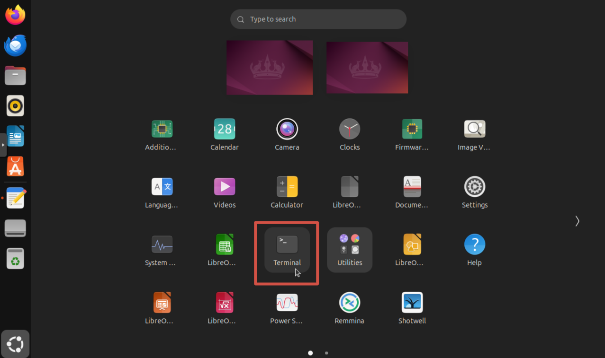
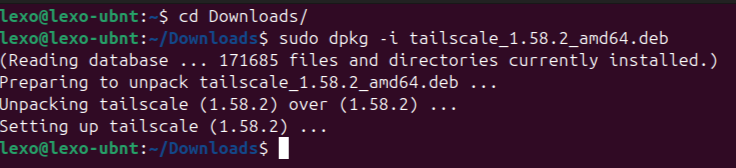

### Инструкция для Linux (Ubuntu).

Начнём со скачивания и установки необходимого для подключения ПО.

### Установка ПО

**Шаг 1.** В Linux есть встроенный клиент для подключения с помощью SSH, но мы воспользуемся программой **Terminal** — она позволяет взаимодействовать с системой с помощью команд. 

Нажмите Show Apps в левом нижнем углу и найдите Terminal. Запомните где он находится, он понадобиться нпм чуть позже.

||
|-|
| _Так Terminal выглядит в Ubuntu_ |

**Шаг 2.** **Tailscale** — это современный сервис для создания {{приватных сетей}}[sys_admin_sprint_1 Ещё они известны как VPN. Аббревиатура образована от англ. Virtual Private Network, что дословно переводится как «виртуальная приватная сеть».], основанный на принципах безопасности и удобства. 

Соединять устройства и сети с ним довольно просто, и при обмене данными и ресурсами они будут защищены на уровне шифрования и аутентификации. Дистрибутив доступен по ссылке: `https://sysadmin.education-services.ru/downloads/tailscale_1.58.2_amd64.deb`.

Скачайте архив и откройте терминал. В открывшемся окне введите команды:

```
cd Downloads/

sudo dpkg -i tailscale_1.58.2_amd64.deb
```
При необходимости введите пароль администратора(root'a):

||

Программа установлена.

>[Реплика героя курса] Пока что программа не настроена, об этом — дальше.

### Настройка доступа

Откройте встроенный терминал — он находится в папке `Applications` («Программы»), подпапке `Utilities` («Утилиты»).

|||
|-|-|
| _Переходим в Utilities («Утилиты»)_ | _Запускаем терминал_ |

В открывшемся окне введите следующую команду и нажмите `Enter`:

```
alias tailscale="/Applications/Tailscale.app/Contents/MacOS/Tailscale"
```

Затем — эту, и снова нажмите `Enter`:

```
tailscale login --shields-up --accept-routes --login-server https://vpn.sysadmin.education-services.ru
```

В ответ будет выдана ссылка — её нужно скопировать и вставить в браузер, или же вы будете сразу перенаправлены в браузер. При переходе по ссылке система предложит ввести логин и пароль, которые вы получили ранее, — введите их. Дальше появится окно `Mobile Authenticator Setup`.

||||
|-|-|-|
| _Копируем ссылку и открываем её в браузере_ | _Указываем логин и пароль_ | _Видим уведомление о том,что нам нужно установить приложение_ |


В нём говорится, что на смартфон необходимо установить приложение для получения одноразовых паролей — для подключения к инфраструктуре используется двухфакторная аутентификация. 

Для примера мы будем использовать приложение **FreeOTP**. Зайдите в него, нажмите на иконку QR-кода — если приложение запросит разрешение на использование камеры, согласитесь. Затем наведите камеру на QR-код с сайта авторизации. В результате в приложении создастся токен для вашей учётной записи, который будет генерировать случайные одноразовые пароли.

Сайт же пропустит вас дальше, предложив ввести одноразовый пароль и имя устройства. Пароль нужно взять из приложения, а имя устройства можете придумать самостоятельно. Затем нажмите `Submit` («Подтвердить»). Если отобразилась надпись `Authenticated as <>, you can now close this window` — всё хорошо, сайт можно закрывать. После этого Tailscale подключится автоматически, в дальнейшем для подключения и отключения используйте ползунок.

|||||||
-|-|-|-|-|-
| _Загружаем приложение FreeOTP и заходим в него_| _Нажимаем на иконку QR-кода_ | _Используем одноразовый пароль из приложения — у вас он будет свой_ | _Вводим пароль и имя устройства_| _Всё получилось! Сайт можно закрывать_| _Итог: Tailscale подключился автоматически_ |

>[Реплика героя курса] Переходим в Terminus. 

Нажмите на кнопку `New Host` и заполните поля, как на нашем скрине. В графу `Address` вставьте `cloudshell.sysadmin.local`. Укажите пароль, который вам выдали. Для подключения к хостам одноразовый пароль из FreeOTP использовать не нужно.

|||||
|-|-|-|-|
| _Нажимаем на кнопку New Host — она находится в левом верхнем углу_ | _Для заполнения полей используйте данные с этого скриншота_ | _Пароль у вас будет свой_ | _Вот что вы увидите, если введёте всё верно_|

Добро пожаловать и успехов!
