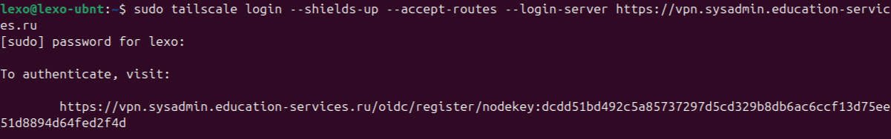
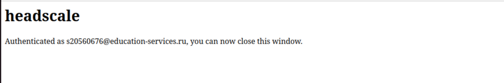
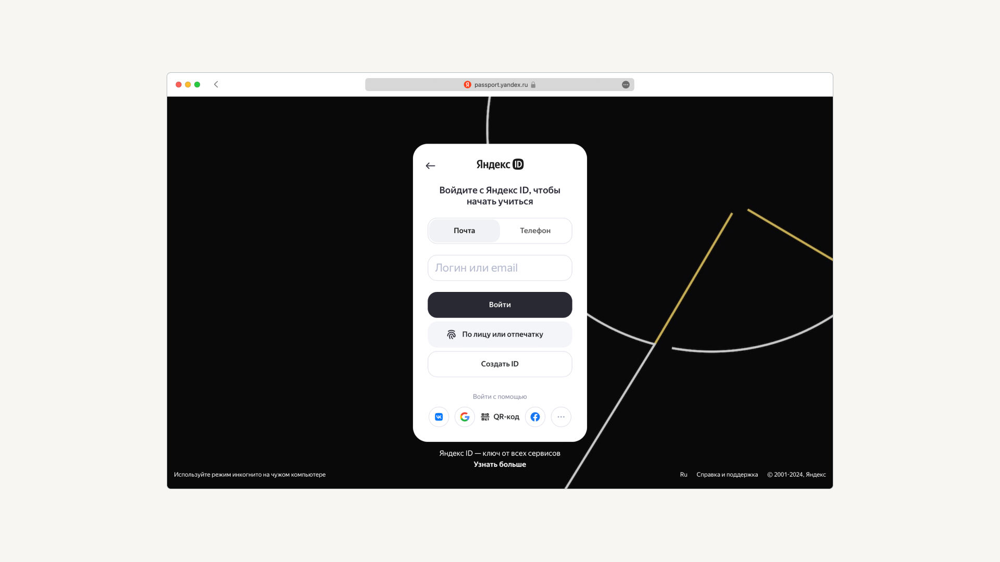

### Инструкция для Linux (Ubuntu).

Начнём со скачивания и установки необходимого для подключения ПО.

### Установка ПО

**Шаг 1.** В Linux есть встроенный клиент для подключения с помощью SSH, но мы воспользуемся программой **Terminal** — она позволяет взаимодействовать с системой с помощью команд. 

Нажмите Show Apps в левом нижнем углу и найдите Terminal. Запомните где он находится, он понадобиться нпм чуть позже.

||
|-|
| _Так Terminal выглядит в Ubuntu_ |

**Шаг 2.** **Tailscale** — это современный сервис для создания {{приватных сетей}}[sys_admin_sprint_1 Ещё они известны как VPN. Аббревиатура образована от англ. Virtual Private Network, что дословно переводится как «виртуальная приватная сеть».], основанный на принципах безопасности и удобства. 

Соединять устройства и сети с ним довольно просто, и при обмене данными и ресурсами они будут защищены на уровне шифрования и аутентификации. Дистрибутив доступен по ссылке: `https://sysadmin.education-services.ru/downloads/tailscale_1.58.2_amd64.deb`.

Скачайте архив и откройте Terminal. В открывшемся окне введите команды:

```
cd Downloads/

sudo dpkg -i tailscale_1.58.2_amd64.deb
```
При необходимости, введите пароль администратора(root'a):

||

Программа установлена.

>[Реплика героя курса] Пока что программа не настроена, об этом — дальше.

### Настройка доступа

Откройте Terminal, введите команду и нажмите Enter:

```
tailscale login --shields-up --accept-routes --login-server https://vpn.sysadmin.education-services.ru
```

В ответ будет выдана ссылка — её нужно скопировать и вставить в браузер, или же вы будете сразу перенаправлены в браузер. При переходе по ссылке система проверит ваши учётные данные и запустит VPN-соединение.


|||
|-|-|
| _Копируем ссылку и открываем её в браузере_ | _Видим уведомление о том,что нам нужно установить приложение_ |


Если отобразилась надпись ```Authenticated as <>, you can now close this window``` — всё хорошо, сайт можно закрывать. После этого Tailscale подключится автоматически, в дальнейшем для подключения и отключения используйте ползунок.

Может случиться так, что ссылка откроется не в том браузере, где вы работаете с учебником Практикума. В этом случае система запросит у вас логин и пароль — те же учётные данные, которые вы использовали для входа на учебную платформу. Введите их, и Tailscale подключится автоматически:

||

Добро пожаловать и успехов!
